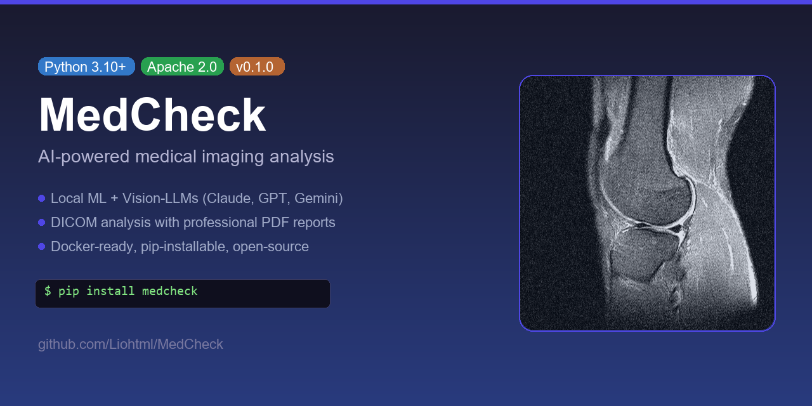

<div align="center">



# MedCheck

**AI-powered medical imaging analysis toolkit**

[](https://github.com/Liohtml/MedCheck/actions/workflows/ci.yml)
[](https://codecov.io/gh/Liohtml/MedCheck)
[](https://pypi.org/project/medcheck/)
[](https://pypi.org/project/medcheck/)
[](https://opensource.org/licenses/Apache-2.0)
[](https://github.com/Liohtml/MedCheck/releases)
[](https://github.com/Liohtml/MedCheck/stargazers)

</div>

MedCheck analyzes MRI scans using local ML models and frontier Vision-LLMs (Claude, GPT, Gemini) to generate professional radiology-style reports with annotated images.

---

**[Quick Start](#quick-start)** · **[Documentation](docs/)** · **[Contributing](CONTRIBUTING.md)** · **[Report Bug](https://github.com/Liohtml/MedCheck/issues/new?template=bug_report.yml)**

---

## Features

- **Plug & Play Docker** — single `docker run` command, no local setup required
- **Multiple data sources** — local DICOM files, easyRadiology platform, and custom plugins
- **Local ML analysis** — on-device inference with LLaVA-Med and MONAI-based models; fully offline capable
- **Vision-LLM analysis** — frontier model support for Claude Opus 4.7, GPT-5.5, and Gemini 3.5 Flash
- **Clinical context input** — attach patient history, symptoms, and prior findings to guide report generation
- **Professional PDF/HTML reports** — annotated images with structured radiology-style findings and impressions
- **YAML workflow engine** — compose and version-control custom analysis pipelines as code
- **Generic anatomy support** — brain, spine, knee, shoulder, abdomen, and more
- **Web UI + CLI** — interactive browser dashboard and a scriptable command-line interface

---

## Quick Start

### Option 1 — Docker (recommended)

```bash
docker run -p 8080:8080 \
  -e ANTHROPIC_API_KEY=your_key_here \
  -v $(pwd)/scans:/data/scans \
  ghcr.io/liohtml/medcheck:latest
```

Then open [http://localhost:8080](http://localhost:8080).

### Option 2 — pip install

```bash
pip install medcheck
medcheck serve
```

### Option 3 — From source

```bash
git clone https://github.com/Liohtml/MedCheck.git
cd MedCheck
uv sync
uv run medcheck serve
```

---

## How It Works

```
┌─────────┐    ┌────────────┐    ┌────────────┐    ┌───────────┐    ┌────────┐
│  Ingest  │───▶│ Preprocess │───▶│ ML Analyze │───▶│ Vision AI │───▶│ Report │
│          │    │            │    │            │    │           │    │        │
│ DICOM /  │    │ Normalize  │    │ LLaVA-Med  │    │ Claude /  │    │ PDF /  │
│ easyRad  │    │ Resize     │    │ MONAI      │    │ GPT /     │    │ HTML   │
│ Plugins  │    │ Anonymize  │    │ Anomaly    │    │ Gemini    │    │ + PNG  │
└─────────┘    └────────────┘    └────────────┘    └───────────┘    └────────┘
```

1. **Ingest** — load studies from local paths, the easyRadiology portal, or third-party plugins.
2. **Preprocess** — normalize pixel values, resize to model input dimensions, and strip PHI.
3. **ML Analyze** — run local segmentation and anomaly-detection models (no API key required).
4. **Vision AI** — send annotated slices to a frontier Vision-LLM for language-based findings.
5. **Report** — render a structured radiology report with annotated images in PDF and HTML.

---

## Supported Models

| Model | Provider | Best For |
|---|---|---|
| **Claude Opus 4.7** | Anthropic | Highest diagnostic quality and reasoning depth |
| **GPT-5.5** | OpenAI | High-resolution image understanding |
| **Gemini 3.5 Flash** | Google | Speed-optimized, cost-effective batch processing |
| **LLaVA-Med** | Local | Fully offline, no API key required |

---

## Data Sources

| Source | Type | Notes |
|---|---|---|
| **Local DICOM** | Folder / ZIP | Point to any directory or ZIP of DICOM files |
| **easyRadiology** | Portal link | Uses access code + date of birth (provided by your clinic) |
| **Custom providers** | Plugin | See [docs/providers.md](docs/providers.md) |

---

## Configuration

Copy `.env.example` and fill in your API keys:

```bash
cp .env.example .env
```

```dotenv
# LLM API Keys (at least one needed for Vision analysis)
ANTHROPIC_API_KEY=        # https://console.anthropic.com/settings/keys
OPENAI_API_KEY=           # https://platform.openai.com/api-keys
GOOGLE_API_KEY=           # https://aistudio.google.com/apikey

# Defaults
MEDCHECK_LLM_PROVIDER=claude   # claude | openai | gemini | local
MEDCHECK_LANGUAGE=en           # en | de
MEDCHECK_PORT=8080
```

> **Note:** easyRadiology requires no API key. Authentication uses the access code + date of birth provided by your radiology clinic (via SMS, email, or letter).

### Docker environment variables

```bash
docker run -p 8080:8080 \
  -e ANTHROPIC_API_KEY=sk-... \
  ghcr.io/liohtml/medcheck:lite
```

---

## Custom Workflows

Define analysis pipelines as YAML and commit them alongside your code:

```yaml
# workflows/full_analysis.yml
name: full_analysis
description: Complete MRI analysis with ML and Vision-LLM

steps:
  - ingest:
  - preprocess:
      normalize: true
      auto_detect_anatomy: true
  - ml_analysis:
      models: [anomaly_detection, feature_extraction]
  - vision_analysis:
      provider: claude
      clinical_context:
        symptoms: "Medial knee pain after sports injury"
        trauma: "Valgus stress, 10 days ago"
  - report:
      format: pdf
      language: en
```

Run a workflow:

```bash
medcheck analyze --source ./dicoms --workflow workflows/default.yml
```

Discover what's available:

```bash
medcheck providers   # list registered data providers
medcheck models      # list LLM providers, default models, and availability
```

---

## Documentation

| Topic | Link |
|---|---|
| Quickstart guide | [docs/quickstart.md](docs/quickstart.md) |
| Data providers & plugins | [docs/providers.md](docs/providers.md) |
| Workflow engine reference | [docs/workflows.md](docs/workflows.md) |
| Supported models | [docs/models.md](docs/models.md) |

---

## Contributing

Contributions are welcome. Please read [CONTRIBUTING.md](CONTRIBUTING.md) first.

```bash
git clone https://github.com/Liohtml/MedCheck.git
cd MedCheck
uv sync
pre-commit install
pytest
```

All pull requests require passing CI and at least one approving review.

---

## Acknowledgments

MedCheck builds on the shoulders of excellent open-source work:

- [Stanford MRNet](https://stanfordmlgroup.github.io/competitions/mrnet/) — benchmark dataset for knee MRI analysis
- [Project MONAI](https://monai.io/) — PyTorch-based framework for medical image learning
- [pydicom](https://pydicom.github.io/) — pure-Python DICOM file I/O

---

> **Disclaimer**
>
> **MedCheck is NOT a medical device and has NOT been cleared or approved by any regulatory authority (FDA, CE, or otherwise). It is intended solely as a research and educational tool. All outputs must be reviewed and verified by a qualified radiologist or licensed medical professional before use in any clinical decision-making context. Do not use MedCheck as a substitute for professional medical advice, diagnosis, or treatment.**

---

## License

Distributed under the [Apache License 2.0](LICENSE).
