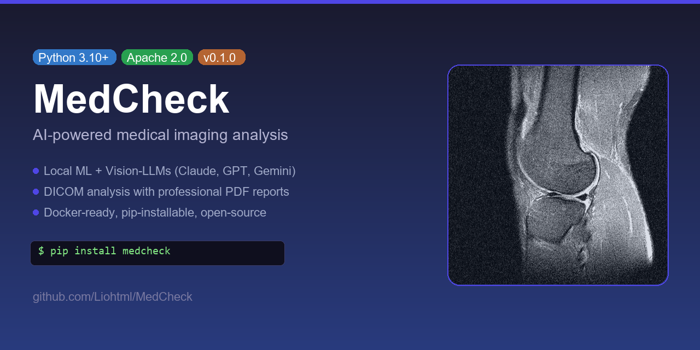

<div align="center">



# MedCheck

**AI-powered medical imaging analysis toolkit**

[](https://github.com/Liohtml/MedCheck/actions/workflows/ci.yml)
[](https://codecov.io/gh/Liohtml/MedCheck)
[](https://pypi.org/project/medcheck/)
[](https://pypi.org/project/medcheck/)
[](https://github.com/Liohtml/MedCheck/pkgs/container/medcheck)
[](https://opensource.org/licenses/Apache-2.0)
[](https://github.com/Liohtml/MedCheck/releases)
[](https://github.com/Liohtml/MedCheck/stargazers)

Analyze MRI scans with local ML models and frontier Vision-LLMs (Claude, GPT, Gemini)
and generate structured, radiology-style reports — from the CLI, a web UI, or Docker.

**[Quick Start](#quick-start)** · **[Usage](#usage)** · **[Configuration](#configuration)** · **[Docs](docs/)** · **[Contributing](#contributing)** · **[Report Bug](https://github.com/Liohtml/MedCheck/issues/new?template=bug_report.yml)**

</div>

> ⚠️ **MedCheck is a research and educational tool, NOT a medical device.** Every
> output must be reviewed by a qualified radiologist before any clinical use.
> See the full [disclaimer](#disclaimer) below.

---

## Features

- DICOM folders, individual files, ZIP archives and DICOMDIR media; explicit study selection.
- Local image quality checks and relative image statistics without cloud keys or model downloads in the web workbench.
- Optional Claude, OpenAI, Gemini or user-managed local vision inference.
- Browser uploads, background progress, cancellation, slice viewer and downloadable reports.
- Findings review with an audit trail, analysis provenance and reference-report text comparison.
- JSON, HTML, PDF, preliminary FHIR DiagnosticReport and unverified DICOM SR exports.
- Metadata de-identification, explicit pixel review and optional local OCR masking.
- YAML workflows and saved-report regression evaluation against independent reference labels.

## Quick Start

### From this checkout

```bash
git clone https://github.com/Liohtml/MedCheck.git
cd MedCheck
uv sync
uv run medcheck serve
```

Open [http://localhost:8080](http://localhost:8080). Upload a DICOM ZIP or individual
DICOM file, inspect the study and run a local analysis. No API key is required.
The local statistics mode generates no diagnostic findings. For cloud vision,
install the corresponding SDK first:

```bash
uv sync --extra cloud  # or --extra claude, --extra openai, --extra gemini
```

### Docker

Build the current checkout, then bind the published port to localhost:

```bash
docker build --target lite -t medcheck:lite .
docker run --rm -p 127.0.0.1:8080:8080 \
  -v medcheck-state:/app/.medcheck medcheck:lite
```

The lite image includes cloud SDKs and local statistics. The `full` target adds
PyTorch/torchvision for feature extraction; it does not bundle a vision language
model. Keep the state volume to retain jobs and reports between container runs.
See [Quick Start](docs/quickstart.md) and [Workbench](docs/workbench.md).

### CLI

```bash
# Local image statistics and JSON report:
uv run medcheck analyze ./my-dicom-folder \
  --steps ingest,preprocess,ml_analysis,report --report json --deidentify

# Cloud vision: install the SDK, set ANTHROPIC_API_KEY, review the input,
# then explicitly permit transmission:
uv run medcheck analyze ./my-dicom-folder \
  --model claude --allow-cloud-llm --pixels-reviewed --deidentify \
  --symptoms "Medial knee pain after sports injury" --report pdf --lang en

# Prompt for missing inputs:
uv run medcheck analyze ./my-dicom-folder --interactive
```

Reports are written to `./output/`. `--deidentify` reduces identifying metadata;
it does not guarantee anonymous pixels or free text.

## How it works

1. Load and select a study using DICOM study and series identifiers.
2. Optionally remove identifying metadata and remap instance identifiers.
3. Check image geometry, normalize pixels and assemble volumes.
4. Compute relative image statistics or optional image features.
5. Optionally select images across series for a chosen vision provider.
6. Record provenance, limitations and findings in a research report.

A high within-series image score is not a disease probability. LLM confidence is
an uncalibrated self-assessment. Neither is an estimate of clinical accuracy.

## Usage

```bash
medcheck analyze SOURCE [OPTIONS]
medcheck serve
medcheck providers
medcheck models
medcheck evaluate manifest.json --output evaluation.json
```

| Analyze option | Purpose |
|---|---|
| `--model` | Vision provider: `claude`, `openai`, `gemini`, `local` |
| `--allow-cloud-llm` | Permit external image/context transmission |
| `--pixels-reviewed` | Confirm independent review for identifiers before cloud transmission |
| `--deidentify` | Remove identifying metadata and pseudonymize report identity |
| `--study-uid` | Select one study from a multi-study source |
| `--symptoms`, `--trauma`, `--diagnosis` | Supply context |
| `--official-report` | Read a UTF-8 reference report for local text comparison |
| `--ocr-redact` | Mask OCR-detected text using optional local Tesseract |
| `--report` | `json`, `html`, `pdf`, `fhir`, `dicom-sr` |
| `--lang` | `en`, `de`, `fr`, `es` |
| `--steps`, `--workflow` | Choose steps or a YAML workflow |

Run `medcheck analyze --help` for the full interface.

### REST API

| Endpoint | Purpose |
|---|---|
| `GET /health` | Public liveness check |
| `GET /api/capabilities` | Provider availability and configured limits |
| `POST /api/upload`, `POST /api/inspect` | Upload and inspect study contents |
| `POST /api/preview` | Show provider, transmission and configured cost estimate |
| `POST /api/analyze` | Queue analysis; returns HTTP 202 and a job ID |
| `GET /api/jobs/{id}` | Progress, errors and completed result |
| `POST /api/jobs/{id}/cancel` | Request cancellation between pipeline steps |
| `GET /api/jobs/{id}/images/{series}/{slice}` | View a normalized PNG slice |
| `GET /api/jobs/{id}/report?format=json` | Download a completed report |
| `PATCH /api/jobs/{id}/findings/{index}` | Review or edit a finding with audit history |
| `DELETE /api/jobs/{id}` | Remove a finished job and its artifacts |

All `/api/*` routes require `X-API-Key` when `MEDCHECK_API_KEY` is configured.
Uploads, inspection and analysis share the per-client request rate limit.
Server-side sources must stay within `MEDCHECK_DATA_ROOT`; uploaded files use
opaque identifiers. See [Workbench](docs/workbench.md) for operation and retention.

## Providers and configuration

Cloud SDKs are optional; availability requires both installation and a key.
Default model IDs can be changed through `MEDCHECK_CLAUDE_MODEL`,
`MEDCHECK_OPENAI_MODEL` and `MEDCHECK_GEMINI_MODEL`. No provider is ranked by
clinical accuracy: MedCheck has not established such a comparison.

Local vision uses an explicitly configured OpenAI-compatible server on a literal
loopback IP address. Set `MEDCHECK_LOCAL_URL` and `MEDCHECK_LOCAL_MODEL`. MedCheck
does not download or launch a vision model. See [Models](docs/models.md).

| Variable | Purpose |
|---|---|
| `ANTHROPIC_API_KEY`, `OPENAI_API_KEY`, `GOOGLE_API_KEY` | Cloud credentials |
| `MEDCHECK_LLM_PROVIDER` | Default CLI vision provider |
| `MEDCHECK_HOST`, `MEDCHECK_PORT` | Server bind address and port; defaults `127.0.0.1:8080` |
| `MEDCHECK_API_KEY` | API authentication |
| `MEDCHECK_DATA_ROOT` | Allowed server-side source directory |
| `MEDCHECK_STATE_DIR` | Jobs, uploads and report storage |
| `MEDCHECK_MAX_UPLOAD_BYTES`, `MEDCHECK_MAX_JOBS` | Upload and job retention limits |
| `MEDCHECK_MAX_VISION_IMAGES` | Maximum images selected for vision analysis |
| `MEDCHECK_RATE_LIMIT` | Requests per client per minute; `0` disables |

Use environment variables or a container's `--env-file`; copying `.env.example`
alone does not load environment variables into a shell process.

## Privacy & Security

Cloud analysis requires explicit transmission consent and pixel review. Metadata
allow-listing, UID remapping, known-identifier text replacement and optional OCR
reduce exposure; embedded text, recognizable anatomy and unknown free-text
identifiers still need independent review. Review annotations do not certify a
report or make the model clinically validated.

The web workbench defaults to de-identification. CLI de-identification is enabled
with `--deidentify`. Treat stored uploads, images, reports and review history as
sensitive. Delete finished jobs and unneeded uploads when no longer needed.

The server binds to localhost by default. Use authentication for network access.
The local vision transport rejects remote URLs, redirects and environment
proxies; its user-managed server must itself be configured for local inference.

See [SECURITY.md](SECURITY.md), [Model Card](docs/model-card.md) and
[Intended Use](docs/intended-use.md).

## Custom workflows

```bash
medcheck analyze ./dicoms --workflow workflows/default.yml
```

See [Workflow Reference](docs/workflows.md) for step configuration. Workflow and
explicit step choices determine whether vision inference runs; select local
statistics when external inference is not required.

## Documentation

- [Quick Start](docs/quickstart.md)
- [Web Workbench](docs/workbench.md)
- [Data Providers](docs/providers.md)
- [Models and SDK installation](docs/models.md)
- [Report Regression Evaluation](docs/evaluation.md)
- [Intended Use](docs/intended-use.md)
- [Model Card](docs/model-card.md)

---

## Contributing

Contributions of every size are welcome — from typo fixes to new data providers.

**Where to start:**

- 🟢 [`good first issue`](https://github.com/Liohtml/MedCheck/issues?q=is%3Aissue+is%3Aopen+label%3A%22good+first+issue%22) — small, well-scoped tasks with pointers
- 🙋 [`help wanted`](https://github.com/Liohtml/MedCheck/issues?q=is%3Aissue+is%3Aopen+label%3A%22help+wanted%22) — features we'd love help with (new providers, evaluation datasets, …)
- 🗺️ [Roadmap epic #51](https://github.com/Liohtml/MedCheck/issues/51) — validation & enhancement pipeline stages

**Dev setup:**

```bash
git clone https://github.com/Liohtml/MedCheck.git
cd MedCheck
uv sync --extra dev
pre-commit install

# Quality gates (same as CI):
uv run pytest --cov=medcheck --cov-fail-under=85
uv run ruff check src tests && uv run ruff format --check src tests
uv run mypy src
uv run bandit -r src/medcheck -ll -q
```

Please read [CONTRIBUTING.md](CONTRIBUTING.md) before opening a PR. All pull
requests require passing CI and at least one approving review.

---

## Acknowledgments

MedCheck builds on the shoulders of excellent open-source work:

- [Stanford MRNet](https://stanfordmlgroup.github.io/competitions/mrnet/) — benchmark dataset for knee MRI analysis
- [Project MONAI](https://monai.io/) — PyTorch-based framework for medical image learning
- [pydicom](https://pydicom.github.io/) — pure-Python DICOM file I/O

---

## Disclaimer

> **MedCheck is NOT a medical device and has NOT been cleared or approved by any regulatory authority (FDA, CE/EU MDR, or otherwise). It is intended solely as a research and educational tool. It must NOT be used to diagnose, screen for, or rule out any condition. All outputs must be reviewed and verified by a qualified radiologist or licensed medical professional before use in any clinical decision-making context. Do not use MedCheck as a substitute for professional medical advice, diagnosis, or treatment.**
>
> See **[Intended Use & Positioning](docs/intended-use.md)** for the scope and the do/don't boundary, and the **[Model Card](docs/model-card.md)** for limitations and known risks.

---

## License

Distributed under the [Apache License 2.0](LICENSE).
